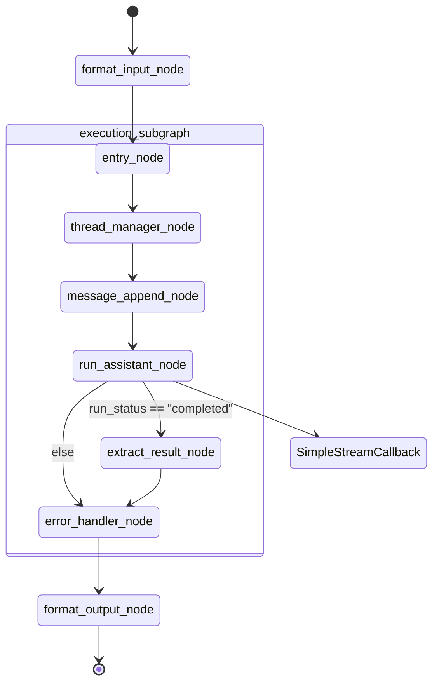

# LangGraph 기반 코드 실행 시스템 - 개발 보고서

소스 코드: [GitHub Repository](https://github.com/swseo-est/pilot_code_agent)
데모 실행 방법은 [Repository README.md](https://github.com/swseo-est/pilot_code_agent#code-agent-chatbot-테스트-안내)를 참고하시기 바랍니다.

## 1. 프로젝트 개요

### 1.1 프로젝트 목적
OpenAI Assistant의 `code_interpreter`를 활용하여 사용자의 자연어 요청 중 코드 실행이 필요한 경우, 자동으로 코드를 생성하고 실행하며 결과를 반환하는 시스템 개발

### 1.2 주요 기능
- LangGraph 기반의 그래프 형태 실행 흐름 구성
  - 모듈화된 노드 구조로 유연한 확장성 제공
  - 비동기 처리를 통한 효율적인 실행 관리
  - YAML 기반의 동적 설정 관리

- 코드 실행 및 결과 처리
  - Python 코드 생성 및 실행
  - OpenAI Sandbox 환경을 활용한 안전한 실행
  - 구조화된 결과 포맷팅 (JSON)

- 실시간 스트리밍 및 시각화
  - 코드 생성 과정 실시간 출력
  - 실행 결과 스트리밍 처리
  - 결과 설명 및 해석 제공

- 에러 처리 및 안정성 확보
  - 실행 시간 제한 및 리소스 관리
  - API 통신 오류 대응


## 2. 요구사항 및 구현 범위

1. 코드 실행 판단
   - 현재는 llm 내부 지식으로 답 할수 있을지 없을지를 스스로 판단하고, 실행이 필요하다고 판단될 경우 코드를 작성하고 실행
2. Python 코드를 작성하고 실행
   - OpenAI 모델을 이용하여 코드를 작성하고 OpenAI Assistant의 격리된 Sandbox 환경에서 실행
3. 코드 실행 결과를 rendering
   - 코드가 작성됨에 따라 실시간으로 코드 작성 Streaming
   - 코드 실행 결과를 보여주고, 그에 대한 해석을 제공
   - 현재 Structured Output으로 구성하여, 추가 요구사항에 따라 구조를 변경하여 정보 추가 가능
   - 예시 :
```
[USER]  100에서 200 사이의 소수를 찾아, 그 소수들의 합, 최소값, 최대값, 평균을 계산해줘

[코드]
def is_prime(n):
    if n <= 1:
        return False
    if n <= 3:
        return True
    if n % 2 == 0 or n % 3 == 0:
    i = 5
    while i * i <= n:
        if n % i == 0 or n % (i + 2) == 0:
            return False
        i += 6
    return True
n1 = 100
n2 = 200
primes = [i for i in range(n1, n2) if is_prime(i)]
sum_of_primes = sum(primes)
min_prime = min(primes)
max_prime = max(primes)
avg_prime = sum_of_primes / len(primes)
results = {
    'primes': primes,
    'sum_of_primes': sum_of_primes,
    'min_prime': min_prime,
    'max_prime': max_prime,
    'avg_prime': avg_prime
}
results  # [END]

=== 실행중 ... ===

[설명]
100에서 200 사이의 소수를 찾아, 그 소수들의 합, 최소값, 최대값, 평균을 계산했습니다. 소수를 확인하는 is_prime 함수를 사용하여 주어진 범위 내의 소수를 리스트로 만들고, 이를 이용해 합계, 최소값, 최대값, 평균을 계산했습니다.

[실행 결과]
{'primes': [101, 103, 107, 109, 113, 127, 131, 137, 139, 149, 151, 157, 163, 167, 173, 179, 181, 191, 193, 197, 199], 'sum_of_primes': 3167, 'min_prime': 101, 'max_prime': 199, 'avg_prime': 150.8095238095238}

[실행 여부]: True
```
4. 파일 입출력, 데이터 시각화
   - OpenAI Playground를 통해 해당 기능에 대한 부분은 테스트함
   - File Id를 어떻게 관리할지 결정하고 해당 부분에 대한 구현 진행가능 - 5.2 Section에 
5. 테스트 케이스 정의
   - 아래의 3가지 카테고리에 대해서 10가지씩 테스트 케이스를 정의하고, 테스트
   - 수치 계산 / 수학 문제
   - 날짜/시간 계산 문제
   - 간단한 통계 분석
6. 사이드 이펙트에 대한 처리
   - timeout 옵션(default=60s)을 두고, 코드 실행이 끝나지 않을 경우 프로세스를 종료하고 관련 에러메시지를 보여줌
   - 코드를 작성하고 실행하였으나, 실행 에러가 발생할 시 해당 사항을 유저에게 알려줌
   - 시스템 명령등 서버에 악영향을 줄 수 있는 요소들에 대해서는 OpenAI의 격리된 환경에서 코드가 실행되어 따로 관리가 필요하지는 않음
7. 가능한 빠르고 효율적으로 구현
   - OpenAI 생태계를 최대한 활용하여, 코드 실행 리소스 및 안정성 관리에 대한 요소를 최소화함
   - 코드 구현 및 실행과 관련된 기능만 담당하는 subgraph를 구현하고, 추후 확장은 input과 output을 관리하는 node로 관리하도록 기능을 분리함
   - MVP(Minimum Viable Product) 전략 채택
     - 핵심 기능에 집중하여 빠른 검증 및 피드백 수집 가능
     - 코드 실행의 기본 플로우를 우선 구현하여 안정성 확보
     - 실제 사용 데이터를 기반으로 한 점진적 고도화 계획 수립
     - 추가 기능 및 비용 최적화는 5장 향후 개선 사항에서 상세 기술
8. 구현 범위 내의 기능이 완결성있게 동작
   - 모든 스크립트에 대해 유닛테스트 코드를 작성하고, 커버리지 91% 달성
   - 외부 벤치마크 MBPP 데이터를 이용하여, 972개 task에 대한 실행을 통해 안정성을 테스트함 (시스템의 안정성외의 정확도에 관한 내용은 4.2 성능 평가에 기술)
   - MVP 범위 내 모든 기능이 높은 신뢰도로 동작함을 검증

 
## 3. 시스템 아키텍처

### 3.1 실행 흐름 구조



### 3.2 주요 컴포넌트 설명
1. 입출력 포맷 관리 - 추후 요구사항에 따로 포맷을 맞춰 구현
   - format_input_node: 외부 입력을 받고, subgraph의 state로 데이터 포맷 변환 
   - format_output_node: subgraph의 출력을 받고, 정의된 양식에 따라 데이터 포맷 변환

2. 실행 서브그래프 (execution_subgraph)
   - entry_node: 그래프 State 초기화 및 설정 로드
   - thread_manager_node: 사용자별 assistant_id 및 thread_id 관리, thread 생애주기 관리
   - message_append_node: 사용자 메시지를 thread에 추가, 메시지 별 id 관리, 
                          추후 파일 업로드시 해당 파일 id를 관리 할 수도 있음(따로 node를 구성해도 됨)
   - run_assistant_node: Assistant 실행 및 상태 관리, 메시지를 streaming으로 받으며 해당 메시지를 실시간으로 Callback으로 넘겨줌.
   - extract_result_node: 실행 결과 추출
   - error_handler_node: 에러 상황 처리

3. 실시간 처리
   - SimpleStreamCallback: Assistant 실행 중 발생하는 스트리밍 데이터 실시간 처리, 현재는 Jupyter Notebook에 그대로 출력하도록 구현. 추후 Integration 방법에 따라 Callback을 추가하면 됨.

## 4. 테스트 및 검증

### 4.1 단위 테스트
1. 테스트 범위
   - 그래프 노드별 단위 테스트 구현
   - 상태 객체 및 유틸리티 함수 테스트
   - 에러 케이스 및 예외 상황 검증

2. 테스트 커버리지
   - 전체 소스코드 커버리지: 91%
   - 주요 테스트 대상
     - 그래프 노드 동작 검증
     - 상태 객체 변환 및 관리
     - API 통신 에러 처리
     - 스트리밍 데이터 처리

### 4.2 성능 평가
1. MBPP 벤치마크 테스트 (GPT-4.1을 이용하여 측정)
   - 대상: MBPP(Mostly Basic Programming Problems) 974개 task
   - 구성: task당 3개의 테스트 케이스
   - 결과: 약 85%의 정확도로 테스트 통과
   - 실행 시간
     - 평균 응답 시간: ~15초
   - 통과 기준
     - 생성된 코드의 실행 시 에러 미발생
     - 제시된 테스트 케이스 정확히 통과

2. 코드 생성 신뢰성
   - 에러 발생률: ~5%
     - 구문 오류, 런타임 에러 등 실행 불가능한 코드
     - 대부분 API 통신 오류나 타임아웃으로 인한 문제
   - 테스트 실패율: ~10%
     - 생성된 코드는 실행 가능하나 구현된 내용이 의도한 바와 다름

3. 실패/에러 케이스 분석
   - 주요 실패 유형
     1. **문법/구현 오류**: 오타, 잘못된 인덱싱, 조건문 오류 등 기본적인 코드 오류
     2. **로직 오류/문제 해석 오류**: 문제 요구사항 오해, 알고리즘 미스 등
     3. **입출력 포맷 불일치**: 반환값 타입, 구조, 포맷 불일치
     4. **예외/경계값 미처리**: 음수, 0, 빈 리스트 등 특수 입력 미처리
     5. **수치/정밀도 오류**: 부동소수점 연산, 반올림 등에서 발생하는 오차


## 5. 향후 개선 사항

### 5.1 Integration 전략

시스템 통합을 위한 두 가지 주요 접근 방식을 고려할 수 있습니다.

#### 5.1.1 Alan 내부 통합
1. Code Agent graph를 LangGraph Tool로 래핑 혹은 Supervisor Node를 두고 Subgraph로 사용
   - 기존 Alan 소스코드에 추가하여 사용
   - Query Analysis Node 또는 Deep Search에서 직접 호출
   - 장점: 가장 빠르게 기능을 추가 가능함
   - 단점: 각 Agent간 결합도가 너무 높아져서, 향후 확장성 및 유지보수에 어려움이 있을 수 있음

#### 5.1.2 독립 서버 구성
1. MCP 서버 구성
   - 독립된 MCP 서버로 구현하여 tool로서 호출
   - 표준화된 인터페이스를 통한 통신
   - 장점: 확장되는 MCP 생태계에 대응하여 서비스를 구성가능함. 독립된 서비스로 동작하여, 유지보수 및 확장에 용이
   - 단점: 기존 Alan을 MCP Host로 동작하도록 수정 필요. 해당 서비스를 Agent가 아닌 Tool로서만 이용가능.(MCP도 로드맵에 A2A와 비슷하게 Agentic Flow를 지원한다고 함)

2. A2A(Agent-to-Agent) 서버 구성
   - 독립된 Agent 서버로 구현
   - 추후 독립된 Agent 서버로 구현된 Multi-agent 시스템 구축 가능
   - 장점: 가장 확장성이 높은 방법. 추후 생태계가 커짐에 따라 외부 Agent와 협업하는 등으로 서비스 확장가능.
   - 단점: Alan의 A2A 형식 구성 필요. MCP에 비해 아직 생태계가 크지는 않음.

### 5.2 추가 구현 가능 요소 및 일정

1. 코드 디버깅 후 retry
   - 예상 일정: POC 후 일정 산출 가능
   - 예상 효과
     - 코드 에러로 인한 실행 실패율 감소
     - 시스템 안정성 향상

2. 데이터 분석 결과 시각화
   - 예상 일정: 0.5일
   - 예상 효과
     - 그래프 등 시각화 자료 제공
     - 수학 공식 등 텍스트 표현의 한계가 있는 내용을 이미지로 제공

3. 파일 업로드 및 분석
   - 예상 일정: 2일
   - 예상 효과
     - 엑셀/CSV 파일 데이터 분석 및 인사이트 제공
     - 대용량 데이터 머신러닝 분석 지원

4. 결과 파일 다운로드
   - 예상 일정: 2일
   - 예상 효과
     - 코드 실행 결과물 파일 다운로드 지원
     - 분석 결과를 엑셀/CSV 형태로 제공

5. Task 특화 Assistant 할당
   - 예상 일정: 0.5일
   - 예상 효과
     - 질문 유형별 최적화된 prompt 기반 assistant 생성
     - 응답 품질 향상 (실험적 검증 필요)

6. Prompt 자동 최적화
   - 예상 일정: POC/프레임워크 검토 후 산출
   - 예상 효과
     - 벤치마크/사용자 피드백 기반 prompt 자동 최적화
     - 사용 데이터 축적에 따른 지속적 성능 개선

7. 스레드 비용 최적화
   - 예상 일정: 1일
   - 예상 효과
     - 스레드 생성 과금 비용 최적화
     - 스레드 재사용 큐 시스템 구현
     - 1시간 초과 스레드 자동 정리

### 6 OpenAI Assistant API 제약사항 및 비용

#### 6.1 과금 정책
1. 세션(스레드) 비용
   - 기본 요금: 세션당 0.03 달러
   - 세션 유지 시간: 1시간
   - 과금 방식
     - 동일 스레드 내 추가 대화는 무료
     - 입출력 토큰에 대한 별도 과금 발생 (일반 모델 사용 비용과 동일)
   - 사용자별 세션 할당 필요

#### 6.2 리소스 제한
1. 스레드 제약
   - 메시지 제한: 스레드당 최대 10만개
   - 실제 사용 시나리오
     - 1시간 내 10만개 요청은 현실적으로 불가능
     - Latency 고려 시 메시지 제한은 실질적 제약 없음

2. Assistant 관리
   - Assistant와 Thread 관계
     - 1:N 관계 지원
     - 과금이 Thread 단위로 발생하므로 1:1 운영이 합리적
   
3. 파일 처리
   - Assistant별 제한
     - 최대 20개 파일
     - 파일당 최대 512MB 또는 500만 token
   - 파일 관리
     - 업로드된 파일에 고유 file id 할당
     - 코드 실행 시 file id 참조 가능
   - API Key별 제한
     - 총 업로드 용량 최대 100GB


